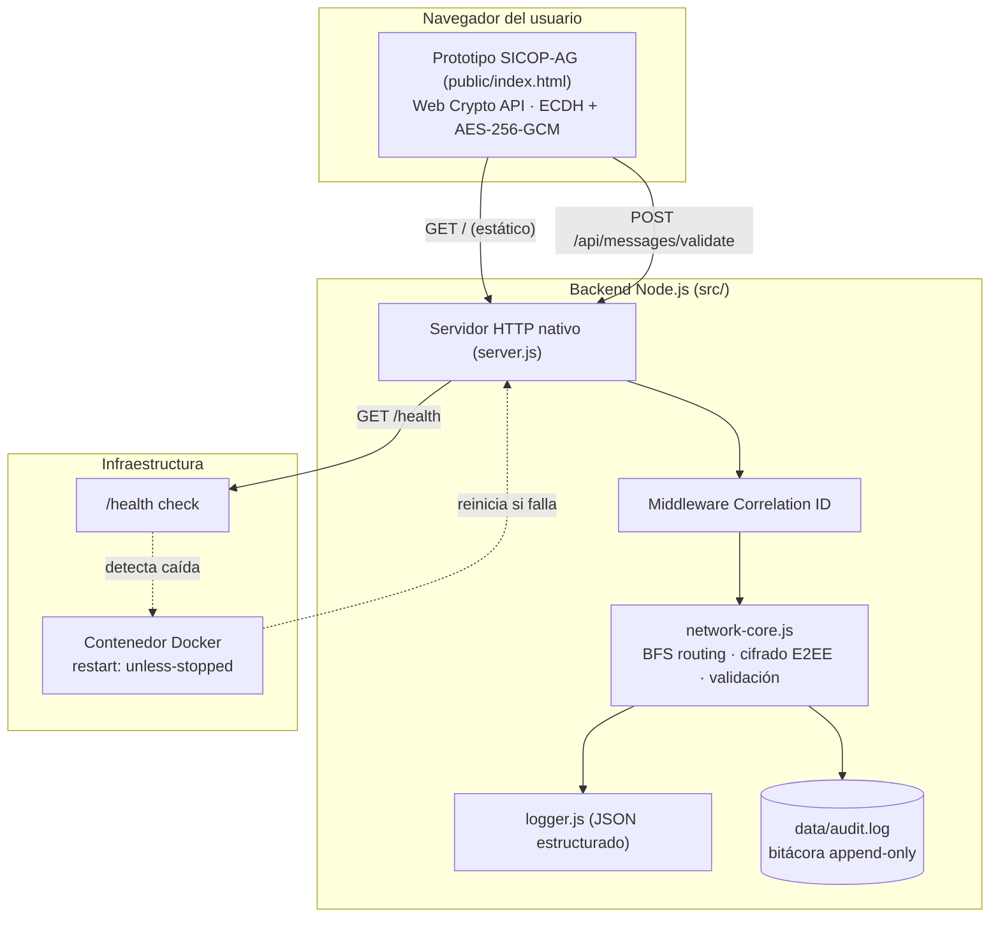
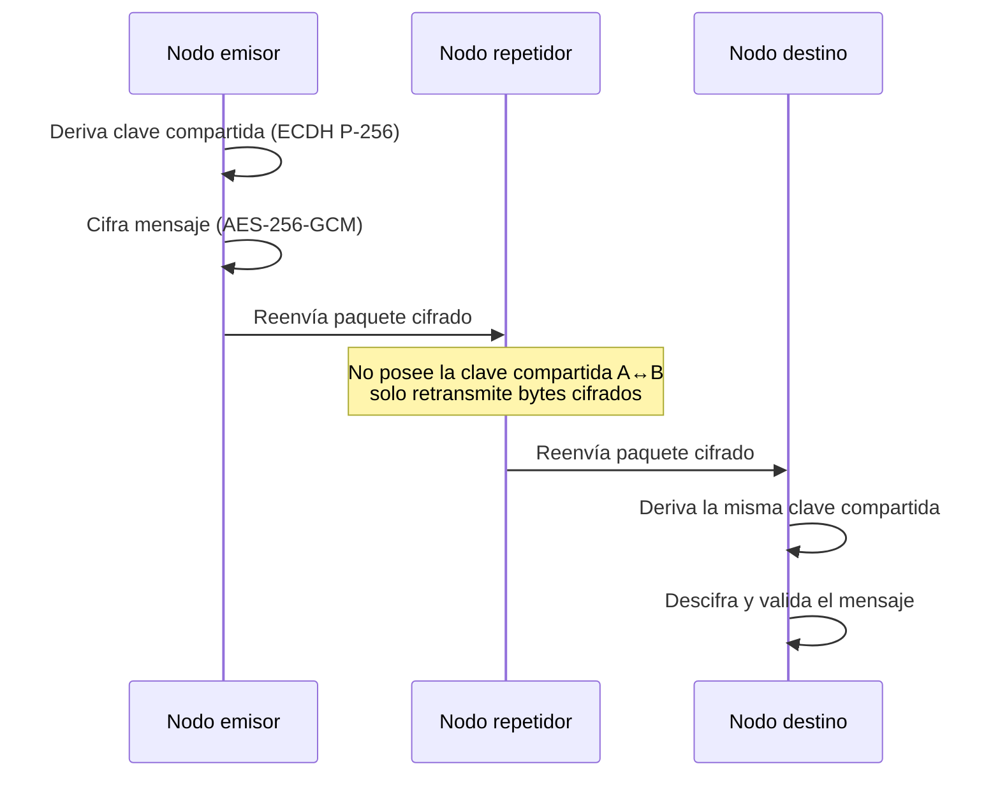
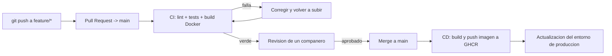

# SICOP-AG — Sistema de Comunicación P2P

[](https://github.com/Wile420/SISTEMA-P2P/actions/workflows/ci.yml)
[](https://github.com/Wile420/SISTEMA-P2P/actions/workflows/cd-docker-publish.yml)

Proyecto de grado — UNEFA, Ingeniería de Sistemas. Prototipo interactivo de
un sistema de comunicación peer-to-peer descentralizado, con backend de
referencia (routing multi-salto, cifrado E2EE real, validación defensiva),
pruebas automatizadas, CI/CD y documentación operativa completa.

## Contenido

- **`public/`** — prototipo interactivo de navegador (SICOP-AG UI): mapa de
  red, mensajería cifrada, control de acceso comandante/operador.
- **`src/`** — backend de referencia en Node.js (cero dependencias en
  runtime): servidor HTTP, lógica de enrutamiento/cifrado/validación,
  logging estructurado.
- **`test/`** — suite de pruebas unitarias (Node test runner nativo).
- **`docs/`** — documentación técnica autogenerada por JSDoc (no se versiona,
  se genera localmente — ver sección *Documentación*).

## Arquitectura del sistema



## Flujo de enrutamiento multi-salto (E2EE)



## Flujo de CI/CD



## Requisitos

- Node.js ≥ 20 (sin ninguna otra dependencia para ejecutar el servidor).
- Docker + Docker Compose (opcional, para el despliegue empaquetado).

## Instalación y ejecución local

```bash
git clone https://github.com/Wile420/SISTEMA-P2P.git
cd SISTEMA-P2P
cp .env.example .env
npm install        # solo instala herramientas de desarrollo (lint/doc); el servidor no tiene dependencias de runtime
npm start           # arranca en http://localhost:3000
```

Verificar que quedó arriba:

```bash
curl http://localhost:3000/health
```

## Pruebas automatizadas

```bash
npm test
```

Corre la suite completa (12 pruebas) sobre la lógica crítica: enrutamiento
BFS, cifrado/descifrado E2EE (ECDH + AES-256-GCM) y validación/saneamiento
de mensajes. Estas mismas pruebas se ejecutan automáticamente en cada Pull
Request vía GitHub Actions (`.github/workflows/ci.yml`); si alguna falla,
el merge queda bloqueado.

## Linter

```bash
npm run lint
```

## Documentación técnica (Doc-as-Code)

El código se documenta a sí mismo con comentarios JSDoc. Para generar el
sitio estático de documentación localmente:

```bash
npm install
npm run doc
```

Esto genera `docs/index.html` — ábrelo en el navegador para explorar cada
módulo, función, parámetro y valor de retorno documentado.

## Despliegue con Docker

```bash
docker compose up -d --build
```

Esto levanta el sistema con política de auto-recuperación
(`restart: unless-stopped`) y health check activo cada 30s.

## Despliegue en producción (CD)

En cada `push`/merge a `main`, el workflow `cd-docker-publish.yml` construye
y publica automáticamente una imagen Docker inmutable en GitHub Container
Registry (`ghcr.io/wile420/sistema-p2p:latest`), sin necesidad de ninguna
cuenta externa. Para que el entorno de producción se actualice solo tras
esa publicación, hay dos caminos (elegir uno):

1. **Recomendado (sin workflow adicional):** conectar el repositorio a un
   proveedor con auto-deploy nativo desde GitHub (Render, Railway, Fly.io —
   todos con capa gratuita). Se activa desde el dashboard del proveedor;
   cada push a `main` dispara el redeploy automáticamente.
2. **Vía webhook:** configurar la variable de repositorio `DEPLOY_HOOK_URL`
   (Settings → Secrets and variables → Actions → Variables) con la URL de
   despliegue del proveedor; el paso final del workflow la invoca sola.

## Control de acceso del prototipo (frontend)

El prototipo de navegador separa dos sesiones por código de acceso:
comandante (control total, incluida la baja de nodos) y operador regular.
Ver el panel "ⓘ Acerca del prototipo" dentro de la propia interfaz para el
detalle completo de las funciones P2P implementadas.

## Documentos relacionados

- [`CONTRIBUTING.md`](./CONTRIBUTING.md) — flujo de ramas, Conventional Commits y proceso de PR.
- [`RUNBOOK.md`](./RUNBOOK.md) — diagnóstico, protocolo ante caídas y recuperación ante desastres.
- [`.env.example`](./.env.example) — variables de entorno requeridas.

## Alcance

Este proyecto es un prototipo académico. La capa de transporte físico entre
dispositivos (Bluetooth mesh / Wi-Fi Direct / radio) para operación de campo
sin conectividad a internet queda fuera de este alcance y correspondería a
una fase de implementación de hardware adicional sobre esta misma
arquitectura lógica.
