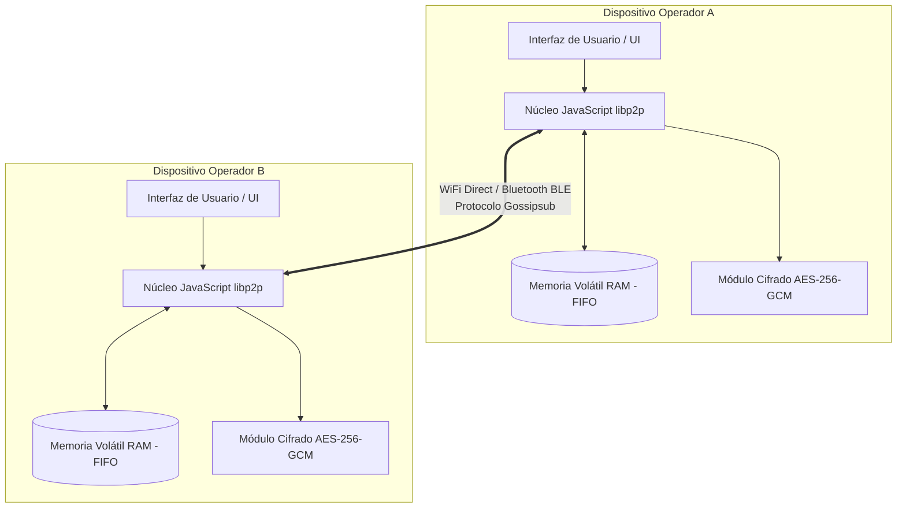

# Sistema de Mensajería Táctica P2P - Batallón "Cnel. Atanasio Girardot"

Este proyecto consiste en un sistema de comunicación militar descentralizado peer-to-peer (P2P) diseñado para operar en entornos tácticos sin infraestructura de red centralizada (Internet, servidores core o bases de datos relacionales tradicionales). El sistema permite el intercambio de mensajes de texto cifrados de extremo a extremo utilizando identificadores militares únicos.

---
### 1. Instrucciones de Instalación y Despliegue Local
### 1. Prerrequisitos
Asegúrese de tener instalado en su sistema:
* Node.js: Versión LTS actual (v20.x o superior).
* NPM: v10.x o superior.
* Sistema Operativo: Linux (Ubuntu 22.04+ recomendado), macOS o * Windows con soporte WSL2.

### 2. Clonar el Repositorio y Ramas
Clone el proyecto y muévase a la rama de integración:
bash
git clone [https://github.com/Wile420/SISTEMA-P2P](https://github.com/Wile420/SISTEMA-P2P)
cd sistema-p2p
npm install
git checkout develop

### 3. Configuración del Entorno Local
Para garantizar la paridad de entornos sin exponer configuraciones secretas del programador, crea tu archivo .env local copiando el formato estándar provisto:

cp .env.example .env
### 4. Ejecución en Modo Desarrollo (Simulación de un Nodo)
Para levantar el nodo táctico y verificar que el motor P2P e inicia la búsqueda de balizas de red, ejecuta:

npm run dev
### 5. Simulación de Red Mesh Local (Prueba de Paridad)
Para probar el sistema P2P sin necesidad de múltiples computadoras, puedes simular una red abriendo dos terminales en tu máquina y forzando el uso de puertos diferentes:

Terminal 1 (Soldado Alfa):
npm run dev

Terminal 2 (Soldado Bravo - Sobrescribiendo puerto en línea de comandos):

P2P_LISTEN_PORT=5001 npm run dev


## 2. Arquitectura y Diagramas del Sistema (Doc-as-Code)

### 2.1. Arquitectura del Sistema
El sistema utiliza una arquitectura descentralizada basada en `libp2p`. Los nodos se descubren localmente mediante mDNS y propagan la información utilizando el protocolo de inundación inteligente Gossipsub.


    gesture
    left to right direction
    actor "Operador Militar" as OM
    actor "Comandante de Unidad" as CM

    rectangle "Sistema P2P Girardot" {
        usecase "Inicializar Identidad Militar" as UC1
        usecase "Escanear Red y Descubrir Pares" as UC2
        usecase "Transmitir Mensaje Táctico" as UC3
        usecase "Recibir Mensaje de Difusión" as UC4
    }

    OM --> UC1
    OM --> UC2
    OM --> UC3
    OM --> UC4

    CM --> UC1
    CM --> UC3
```
```

    sequenceDiagram
    autonumber
    participant Op_Alfa as Operador Emisor (GIR-01)
    participant Op_Bravo as Nodo Repetidor (GIR-02)
    participant Op_Charlie as Nodo Destino (GIR-03)

    Note over Op_Alfa: Escribe mensaje y presiona Transmitir
    Op_Alfa->>Op_Alfa: Cifra texto con AES-256-GCM
    Op_Alfa->>Op_Alfa: Empaqueta en JSON con ID único de mensaje
    Op_Alfa->>Op_Bravo: Publica en canal local vía Gossipsub
    
    Note over Op_Bravo: Recibe paquete de datos
    Op_Bravo->>Op_Bravo: ¿ID de mensaje ya existe en memoria? (No)
    Op_Bravo->>Op_Bravo: Registra ID en histórico temporal RAM
    Op_Bravo->>Op_Charlie: Retransmite (Gossip) automáticamente a sus vecinos
    
    Note over Op_Charlie: Recibe paquete final
    Op_Charlie->>Op_Charlie: Descifra mensaje con llave criptográfica
    Op_Charlie->>Op_Charlie: Despliega texto en pantalla táctica
```
```

    erDiagram
    NODO_MILITAR {
        string peerId PK
        string codigoMilitar UK
        string estadoConexion
    }
    MENSAJE_TACTICO {
        string idMensaje PK
        string codigoEmisor FK
        string tipoDestino
        string textoCifrado
        int timestamp
    }
    HISTORICO_MEMORIA {
        string idMensaje PK
        int registradoAt
    }

    NODO_MILITAR ||--o{ MENSAJE_TACTICO : "genera o recibe"
    MENSAJE_TACTICO ||--|| HISTORICO_MEMORIA : "se registra para evitar bucles en"
```
```

    flowchart TD
    A[Inicio: Nodo Inicializado] --> B[Activar Escaneo de Red local mDNS]
    B --> C{¿Se detectó baliza de nuevo par?}
    C -- No --> D[Esperar intervalo parametrizado en .env]
    D --> B
    C -- Sí --> E[Extraer PeerID e Identidad Militar del par]
    E --> F[Establecer handshake criptográfico mutuo]
    F --> G{¿Conexión Exitosa?}
    G -- No --> B
    G -- Sí --> H[Agregar canal de transmisión a la malla activa]
    H --> I[Sincronizar tabla de peers en RAM] --> B
```
```

    flowchart TD
    A[Llegada de Paquete de Datos via Gossip] --> B[Extraer ID_MENSAJE del payload JSON]
    B --> C{¿ID_MENSAJE existe en Array RAM?}
    C -- Sí --> D[Descartar paquete inmediatamente e ignorar]
    C -- No --> E[Registrar ID_MENSAJE en Array RAM]
    E --> F[Proceder a descifrar contenido]
    F --> G[Desplegar en pantalla para el operador]
    G --> H[Retransmitir paquete a nodos vecinos conectados]
    H --> I[Fin del ciclo de procesamiento]
```

